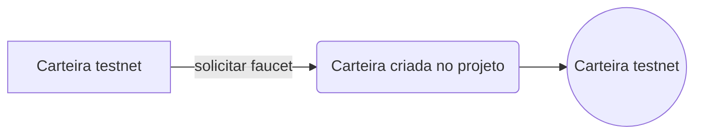

# Bitcoin testnet project

### O objetivo deste projeto é criar uma carteira na testnet do BTC e fazer uma transferencia de teste.

Transações:

https://blockexplorer.one/bitcoin/testnet/address/tb1qern4jlgp28u3yxa2w0j9k9ssy29e7sdk4wz63a

